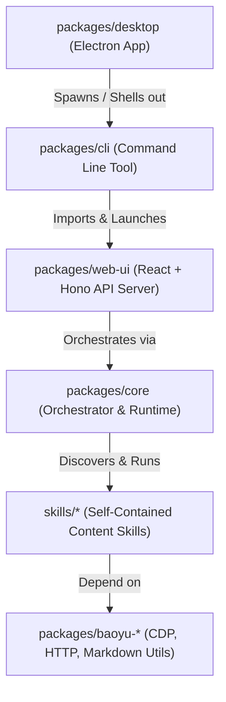

# HappyImage System Design Specification

This document details the architectural design, component interactions, user interface layout principles, and the theme customization framework for HappyImage.

---

## 1. Architectural Overview

HappyImage is structured as a monorepo containing standalone generation skills and applications that provide user-facing CLI, Web UI, and Desktop access.



### Package Responsibilities & Boundaries

1. **`skills/` (Self-Contained Content Skills)**:
   - Standalone content generation plugins (e.g., `image-cards`, `infographic`, `comic`).
   - Each skill contains a `SKILL.md` declaration, a main execution script, default prompts, and reference documents.
   - Fully decoupled from frontend structures.

2. **`packages/core` (Orchestrator & Runtime)**:
   - Manages global configurations and user preferences.
   - Handles LLM (Anthropic) and image generation API routing (OpenAI, DashScope, Google, etc.).
   - Orchestrates generation workflows, project state tracking, and output logs.

3. **`packages/web-ui` (React + Hono Server)**:
   - Interactive user workspace.
   - Runs a lightweight Hono server supplying endpoints for projects, skills, preferences, and Chrome sessions.
   - Standard React frontend built with Vite, Tailwind CSS v4, and Lucide Icons.

4. **`packages/cli` (CLI tool)**:
   - Entry point command `happyimage` for starting the local web app, generating diagnostics (`doctor`), and verifying setup.

5. **`packages/desktop` (Electron runtime)**:
   - Wraps the CLI/server to run local instances of HappyImage as a native desktop sidecar.

---

## 2. Visual & Layout System

HappyImage uses a minimalist, modern, content-first layout characterized by high-contrast typography, theme-aware transitions, and a clean structural hierarchy.

```
+-------------------------------------------------------------------+
|  Logo   |  Page Header                                            |
|  H-Icon |  Settings / History Title                               |
|---------+---------------------------------------------------------|
|         |                                                         |
| Nav     |  Scrollable Main Panel Container                        |
| Links   |  - Left/Right Grid Panels or Steps                      |
|         |  - Forms, Swatches, Inputs                              |
|         |                                                         |
|---------+---------------------------------------------------------|
|         |  [OPTIONAL] Fixed Footer Controls (Prev | Skip | Next)  |
+-------------------------------------------------------------------+
```

### A. Compact Sidebar Layout
The navigation column is optimized at a compact `240px` grid:
* **Brand Logo**: Centered and padded at `w-9 h-9` with a modern gradient.
* **Link Scaling**: Typographic items use `text-sm font-semibold` with Lucide icons set at `w-5 h-5`.
* **Hover Legibility**: Uses dynamic theme variables (`bg-zinc-800` or `bg-indigo-950/30` for active tabs) to maintain readability under both dark and light modes.

### B. Standardized Page Viewports & Scrolling
All system pages (Studio, History, Settings) adhere to a unified scrolling model:
* **Parent Limit**: The parent layout is locked to viewport boundaries (`h-screen overflow-hidden`).
* **Independent Scroll**: Content areas wrap inside `<div className="h-full w-full overflow-y-auto">` wrapper blocks.
* CSS classes `.settings-page` and `.history-page` are strictly layout wrappers containing spacing constraints (`max-w-7xl mx-auto flex flex-col gap-6`), delegating all vertical scroll events to the outer page viewport.

---

## 3. Dynamic Theme & HSL Accent Framework

HappyImage dynamically parses and propagates themes and accent colors on the client side using CSS custom variables.

### A. Theme Variables
Theme modes (`light` or `dark`) write a custom HTML data attribute `data-theme` to the document element:

```css
:root {
  /* Dynamic Hue, Saturation, and Lightness components */
  --accent-h: 239;
  --accent-s: 84%;
  --accent-l: 67%;
  
  /* Derived colors updated dynamically via Javascript */
  --color-accent: hsl(var(--accent-h), var(--accent-s), var(--accent-l));
  --color-accent-light: hsl(var(--accent-h), var(--accent-s), calc(var(--accent-l) + 15%));
  --color-accent-dark: hsl(var(--accent-h), var(--accent-s), calc(var(--accent-l) - 12%));
}
```

### B. Dynamic Accent Color Mapping
Accent transitions evaluate light mode differently than dark mode to ensure text stays legible:
* **Dark Mode**: High lightness accents (`indigo`, `rose`, `emerald`) are combined with dark zinc/slate backgrounds.
* **Light Mode (Inversion)**: Dark accent styles (e.g., text elements, borders) map to readable dark text tones, and light backgrounds map to soft pastel colors (e.g., `hsl(var(--accent-h), var(--accent-s), 95%)`) to prevent poor color contrast.

---

## 4. Settings Preferences & Instant Save Flow

The Settings panel provides quick updates to API credentials, output behaviors, and platform configurations.

```
[Interaction] Swatch Click / Tab Click
        │
        ▼
[Set Draft State] UI state updates instantly
        │
        ▼
[Save API Call] POST /api/settings
        │
        ├───► [Accent Propagation] Client updates CSS HSL variables
        │
        └───► [Theme Propagation] Client writes html[data-theme]
```

### A. Component Replacements
* **Theme Colors (`THEME_COLOR`)**: Rendered as a row of circular color swatches representing the main preset color values (`indigo`, `rose`, `emerald`, `amber`, `cyan`, `violet`). Selecting a swatch applies the HSL hue instantly.
* **Theme Modes (`THEME_MODE`)**: Rendered as a segmented tab control (`Dark`, `Light`, `System`).

### B. Background Saves
Adjustments to appearance options (`THEME_COLOR`, `THEME_MODE`, `DEFAULT_LANGUAGE`, checkboxes) execute `save(key, val)` immediately in the background:
* Avoids forcing manual save button clicks or displaying temporary "saving" banners.
* Keeps the interface clean, reactive, and responsive.

---

## 5. Gallery Wizard Design

The Gallery page uses a step-by-step layout pattern designed to configure a content skill before entering the chat studio.

```
┌─────────────────────────────────────────────────────────┐
│                    Gallery Wizard                       │
├─────────────────────────────────────────────────────────┤
│ [============= Progress Bar: 60% =====================] │
├─────────────────────────────────────────────────────────┤
│                                                         │
│  Scrollable Content (Options / Cards / Preview Grid)    │
│  - Independent overflow-y scrolling                     │
│  - Selectable visual style, aspect ratios, count        │
│                                                         │
├─────────────────────────────────────────────────────────┤
│ [Docked Action Footer]                                  │
│ [上一步]                          [使用默认] [下一步]  │
└─────────────────────────────────────────────────────────┘
```

### A. Continuous Progress Indication
A thin, 4px progress bar is placed at the top of the wizard panel. Segmented dots have been removed to avoid visual clutter.

### B. Anchored Action Footer
The navigation triggers are anchored to a fixed footer (`bg-zinc-900/50 border-t border-zinc-800`) at the bottom of the card panel:
* **Scroll Boundary**: The card contents scroll independently inside their own scroll viewport, while the navigation buttons remain locked in place.
* **Action Types**: Includes `上一步` (Previous), `使用默认` (Skip/Default), and `下一步` / `开始创作` (Next/Create) based on current wizard steps.

### C. Centered Review Panel
The final step (`review`) presents the user's configurations in a centered two-column layout summary:
* Eliminates the duplicate sidebar cards.
* Focuses attention on the final confirmation step before initiating the generation studio.
