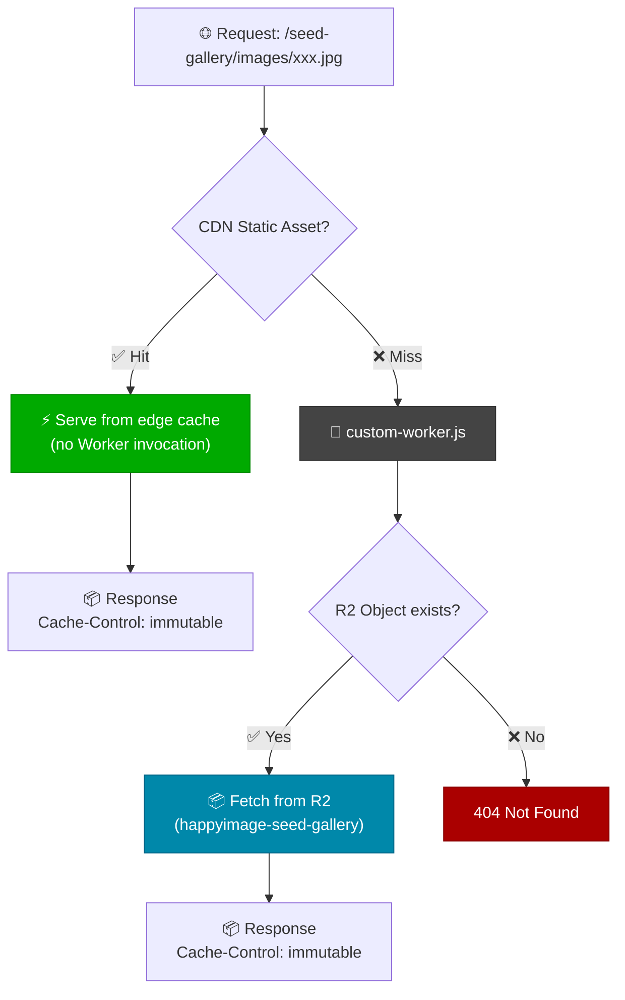

# Official Gallery Static Package

This directory is intentionally ignored except for this README.

Generate or mount the official gallery package here at deploy time:

```text
public/seed-gallery/static/items.json
public/seed-gallery/static/facets.json
public/seed-gallery/static/ids.json
public/seed-gallery/images/...
public/seed-gallery/thumbnails/w640/...
```

Do not commit generated gallery JSON, images, or thumbnails to GitHub.

---

## Architecture: Dual-Storage Serving

Seed-gallery images are served through two layers, providing both speed and
reliability:

| Layer | Storage | Speed | Role |
|-------|---------|-------|------|
| **CDN** (primary) | Cloudflare Workers Static Assets | Fastest | Edge-cached, served directly without Worker invocation |
| **R2** (fallback) | Cloudflare R2 (`happyimage-seed-gallery`) | Fast | Object storage, served via `custom-worker.js` when CDN misses or files aren't deployed |

### Request Flow



### Why Two Layers?

1. **CDN-first**: When seed-gallery files exist in the deployment (mounted locally
   before `pnpm run cf:deploy`), they're pushed to Cloudflare's edge CDN as
   static assets. Requests are served at the edge with zero Worker latency.

2. **R2 fallback**: When deploying from a machine without seed-gallery files
   (e.g., CI), static assets won't include images. The Worker (`custom-worker.js`)
   intercepts `/seed-gallery/*` requests and fetches from R2. No 404s.

3. **R2 is the source of truth**: The `scripts/upload-r2-s3.mjs` script uploads
   all 3,400+ images and thumbnails to R2. The Worker always has a complete copy.

---

## R2 Setup

R2 bucket: `happyimage-seed-gallery`  
Worker binding: `SEED_GALLERY` (configured in `wrangler.jsonc`)

### Upload Seed-Gallery to R2

```bash
# One-time: create R2 API token at https://dash.cloudflare.com/?to=/:account/r2/api-tokens
# Permission: "Object Read & Write"

# Save credentials to .env
# R2_ACCESS_KEY_ID=xxx
# R2_SECRET_ACCESS_KEY=xxx
# R2_ACCOUNT_ID=cf0ed37d49b5ddad4614caa0aa4edb26

# Upload (parallel S3 API, ~7 min for 6,800 files)
source .env && node scripts/upload-r2-s3.mjs
```

### Verify R2 Contents

```bash
npx wrangler r2 object get happyimage-seed-gallery/seed-gallery/static/items.json --remote --pipe | head -c 200
```

---

## Key Files

| File | Purpose |
|------|---------|
| `custom-worker.js` | Worker entry point — intercepts `/seed-gallery/*` and proxies to R2 |
| `wrangler.jsonc` | Worker config — `r2_buckets` binding + `main` entry |
| `scripts/upload-r2-s3.mjs` | Upload seed-gallery to R2 via S3-compatible API |
| `scripts/upload-r2-s3.sh` | Alternative: upload via awscli S3 sync |
